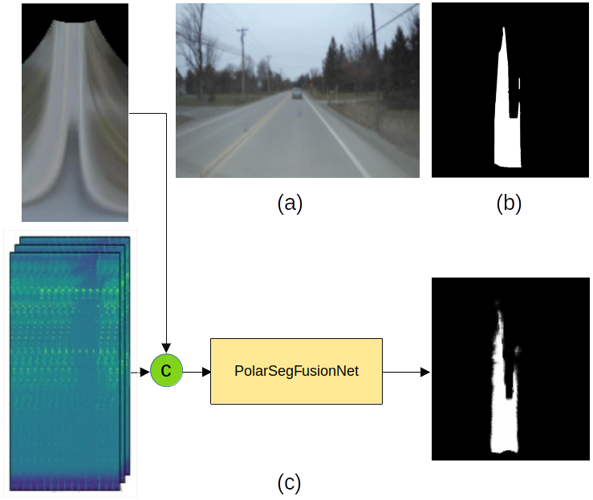

# PolarSegFusionNet: Free Space Segmentation via 4D Imaging Radar and Camera Sensor Fusion

<p align="center">
  
</p> 

The proposed method, named PolarSegFusionNet, is trained by using the image labels in the birds-eye-view polar domain. This repository implements several design choices for deep learning based sensor fusion architectures of 4D radar and camera data, where the fusion is performed at different network depths from which an optimal architecture is derived. Early fusion using PolarSegFusionNet is shown in the above figure: (a) camera image, (b) ground truth in BEV, (c) 4D Radar-Camera early fusion with final prediction. The models are trained and tested on the [RADIal dataset](https://github.com/valeoai/RADIal/tree/main). The dataset can be downloaded
[here](https://github.com/valeoai/RADIal/tree/main#labels:~:text=Download%20instructions).

The architectures with results can be briefly seen in the following video:

[](https://github.com/tue-mps/polarsegfusionnet/assets/95165774/8d5f8810-01bb-4295-a663-64130c1a2bfe)


## Setting up the virtual environment
0. Clone the repo and set up the conda environment:
```bash
$ git clone "this repo"
$ conda create --prefix "your_path" python=3.9 -y
$ conda update -n base -c defaults conda
$ source activate "your_path"
```

1. The following are the packages used:
```bash
$ conda install pytorch==1.12.1 torchvision==0.13.1 torchaudio==0.12.1 cudatoolkit=11.3 -c pytorch
$ pip install -U pip
$ pip3 install pkbar
$ pip3 install tensorboard
$ pip3 install pandas
$ pip3 install shapely
```
## Running the code

### Training
To train a model, a JSON configuration file should be set. 
The configuration file is provided here: `config/config_PolarSegFusionNet.json`

There are 8 architectures namely: only_camera, early_fusion, x0_fusion, x1_fusion, x2_fusion, x3_fusion, x4_fusion and after_decoder_fusion. 
Meaning there is a possibility to train 8 models individually.

For example, to train camera only architecture set the following config parameters appropriately:
```bash
"SegmentationHead": "True",
"radar_input": "False",
"camera_input": "True",
"fusion": "False"
```

And in order to train any fusion architecture set all the following to "True":
```bash
"SegmentationHead": "True",
"radar_input": "True",
"camera_input": "True",
"fusion": "True"
```

Moreover, it is important to select the architecture for training. With the following setting, "x2_fusion" architecture will be chosen. To choose "early_fusion" architecture, simple set "early_fusion": "True" and the remaining to "False" and so on.    
```bash
   "architecture": {
        "only_camera": "False",
        "early_fusion": "False",
        "x0_fusion": "False",
        "x1_fusion": "False",
        "x2_fusion": "True",
        "x3_fusion": "False",
        "x4_fusion": "False",
        "after_decoder_fusion": "False"}
```

Now, to train the chosen architecture, please run:
```bash
$ python 1-Train.py
```
### Evaluation
To evaluate the model performance, please run:
```bash
$ python 2-Evaluation.py
```
### Testing
To obtain qualitative results, please run:
```bash
$ python 3-Test.py
```

## Acknowledgments
- Thanks to Eindhoven University of Technology, Elektrobit Automotive GmbH and Transilvania University of Brașov for assistance in successfully achieving this.
- The code base is influenced by Julien Rebut's RADIal paper. [Code](https://github.com/valeoai/RADIal/tree/main) [Paper](https://arxiv.org/pdf/2112.10646.pdf)

## License
The PolarSegFusionNet repo is released under the Clear BSD license. 
Patent status: "patent applied for".
